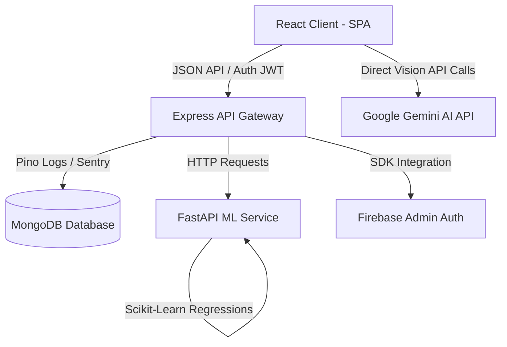

# 🏥 Health Intelligence — AI-Powered Health & Fitness Ecosystem

[](https://reactjs.org/)
[](https://www.typescriptlang.org/)
[](https://nodejs.org/)
[](https://fastapi.tiangolo.com/)
[](https://www.mongodb.com/)
[](https://ai.google.dev/)
[](LICENSE)

Health Intelligence is an advanced, production-grade health and fitness ecosystem designed to unify personalized nutrition, progressive training splits, and biological habit tracking. By combining a beautiful glassmorphic frontend with an Express API gateway and a Python FastAPI machine learning microservice, Health Intelligence provides real-time caloric balance, weight trend projections, and adaptive progressive overload tracking.

---

## 🏗️ Architecture & System Design

Health Intelligence is built using a decoupled, multi-service architecture optimized for local development and cloud deployments:



1.  **React SPA Frontend**: A responsive, typescript-hardened SPA featuring glassmorphic designs, micro-animations (Framer Motion), and real-time interactive charts (Recharts).
2.  **Express.js API Gateway**: Serves as the primary CRUD handler, authentication layer, and proxy gateway. Supports compound indexing, Helmet security headers, Express Rate Limits, and Pino-structured JSON logging.
3.  **FastAPI ML Microservice**: A Python microservice dedicated to statistical computations. Handles weight change estimations using linear regressions on historical weight logs blended with thermodynamic caloric balance projections.
4.  **Flexible Database Layer**: Utilizes a dual-mode database pipeline:
    *   **Production**: Persistent MongoDB via Mongoose.
    *   **Testing**: Isolated integration test coverage using `mongodb-memory-server`.
    *   **Development Fallback**: In-app JSON database read/write simulation (`local_db.json`) when MongoDB is offline, allowing zero-setup offline demos.

---

## ⚡ Key Modules & Features

### 🔑 User Authentication & Profile
*   **JWT Auth**: Secure register/login flows using bcrypt password hashing and stateful validation.
*   **Google Sign-In**: Integrated via Firebase authentication token mapping.
*   **Transactional Verification**: Cryptographic email verification and forgot/reset password workflows.
*   **Centralized Profile Sync**: Context-level synchronization via `AuthContext` dynamically updates top-bar avatars, sidebar user cards, and dashboard greetings in real-time.
*   **Profile Picture Management**: Upload, preview, change, and remove custom profile photos with seamless base64 persistence and auto-generated initials fallbacks.
*   **Navigation Warnings**: Dirty state tracking and window listener guards protect against accidental navigation or tab closure when edits are unsaved.
*   **Adaptive Calculations**: Automatic calculation of BMR, TDEE, and target macros based on the Mifflin-St Jeor equation.

### 📋 Gym Planner & Workout Logging
*   **AI Planner**: Automatically generates training splits based on equipment, workout frequency, and experience level.
*   **Live logger**: Interactive set logging panel with real-time target weight suggestions based on progressive overload rules.
*   **Exercise Wiki**: Manual enrichment search providing instruction guides, target muscle tags, and form mistake warnings powered by Gemini.

### 📸 AI Food Scanner & Meal Tracker
*   **Image Scanning**: Uses Gemini Vision API to parse food images and calculate calories, carbs, protein, fat, and fiber content.
*   **Meal Tracker**: Interactive circular progress indicators showing calorie goals vs. consumption, synchronized with back-end daily logs.

### 🧠 Smart Insights & Habit Tracking
*   **Predictive Analytics**: Computes streak break risk, weight change projections, and lifestyle correlations.
*   **Habit Heatmap**: GitHub-style activity contribution calendar displaying gym check-ins and meal logs over the past 12 weeks.

---

## 🛠️ Technical Stack

### Frontend
*   **Core**: React 18.3.1, TypeScript, Vite, Tailwind CSS
*   **Routing**: React Router DOM 7.9
*   **State**: Context API
*   **Charts & Motion**: Recharts, Framer Motion
*   **Notifications**: React Hot Toast
*   **Testing**: Vitest, JSDOM, React Testing Library

### Backend (Node API)
*   **Core**: Express.js 5.1, Mongoose 9.2 (MongoDB)
*   **Security**: Helmet, CORS, Express Rate Limit
*   **Logging & Telemetry**: Pino Logger, Pino HTTP, Sentry SDK
*   **Documentation**: Swagger-UI, Swagger-JSDoc
*   **Testing**: Jest, Supertest, mongodb-memory-server

### ML Microservice
*   **Core**: Python 3.10+, FastAPI, Uvicorn
*   **Analytics**: Scikit-Learn (Linear Regression), Pandas, Numpy, SciPy
*   **Testing**: Pytest

---

## 🚀 Getting Started

### Prerequisites
*   Node.js 18+ and npm
*   Python 3.10+ (if running ML service locally)

### 💻 Manual Local Development Setup

1.  **Clone the Repository**:
    ```bash
    git clone https://github.com/Venkatatejadegala/Health-intelligence.git
    cd Health-intelligence
    ```

2.  **Configure Environment Variables**:
    Create a `.env` file in the `backend/` and `frontend/` directories:
    *   **Backend (`backend/.env`)**:
        ```env
        PORT=5000
        MONGODB_URI=mongodb://localhost:27017/health_tracker
        JWT_SECRET=your_jwt_signing_key_here
        FRONTEND_URL=http://localhost:5173
        ```
    *   **Frontend (`frontend/.env.local`)**:
        ```env
        VITE_API_URL=http://localhost:5000
        VITE_ML_SERVICE_URL=http://localhost:8000
        VITE_GEMINI_API_KEY=your_gemini_api_key_from_google_studio
        ```

3.  **Install Dependencies & Launch Services**:
    Open three terminal windows to run the components:
    *   **Terminal 1 — Backend API**:
        ```bash
        cd backend
        npm install
        npm start
        ```
    *   **Terminal 2 — Frontend**:
        ```bash
        cd frontend
        npm install
        npm run dev
        ```
    *   **Terminal 3 — Python ML Service**:
        ```bash
        cd ml-microservice
        pip install -r requirements.txt
        uvicorn main:app --reload --port 8000
        ```

---

## 🧪 Testing & Verification

### Backend Tests (Jest)
Runs unit, integration, and database fallback mock tests under an in-memory database configuration:
```bash
cd backend
npm test
```

### Frontend Tests (Vitest)
Runs React component tests, error boundary isolation tests, and layout metrics assertions:
```bash
cd frontend
npm run test
```

### Python ML Tests (Pytest)
Asserts regression predictions, plateau thresholds, and probability matrices:
```bash
cd ml-microservice
pytest
```

---

## 🚀 Production Deployment

*   **Frontend**: Designed to compile to static assets (`npm run build`) and deploy instantly to edge networks like **Vercel** or **Netlify**.
*   **Backend & ML Service**: Optimized for cloud deployments on hosts like **Railway**, **Render**, or **AWS ECS**.

---

## 📋 Future Roadmap
*   [ ] **Wearable Integrations**: Direct API synchronizations with Apple Health and Google Fit.
*   [ ] **Multi-Factor Authentication (MFA)**: Addition of TOTP (Google Authenticator) auth keys.
*   [ ] **Structured Log Rotation**: Configured Pinot log shipping to Datadog/CloudWatch.
*   [ ] **Social Workouts**: Peer-to-peer workout plan sharing features.